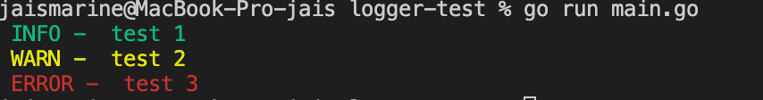

# go-print

## Getting Started

1. get the library

   ```bash
   go get -u github.com/jaisanas/go-print
   ```

2. Usage Example

   ```bash
   package main

   import logger "github.com/jaisanas/go-print"

   func main()  {
       logger.LogInfo("test 1")
       logger.LogWarn("test 2")
       logger.LogError("test 3")
   }
   ```

3. Example output to the terminal
   
